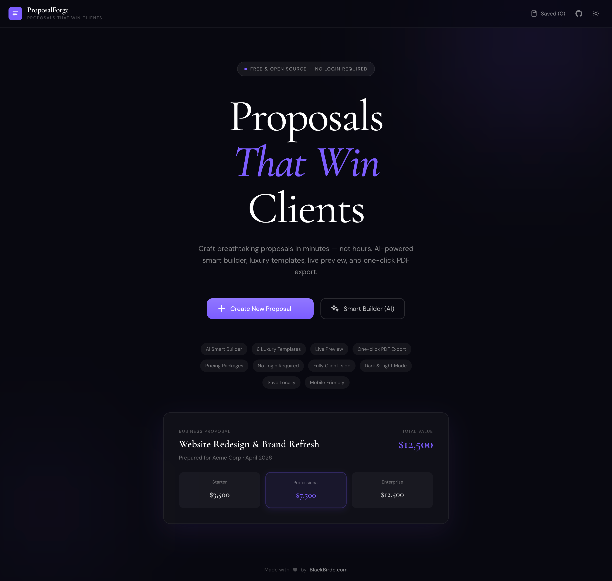

# ProposalForge

## ✨ Preview



*Elegant professional proposal generated with ProposalForge*

**The Most Elegant & Intelligent Proposal Generator**

> Proposals That Win Clients — Free, Open Source, No Login Required

[](LICENSE)
[](https://developer.mozilla.org/en-US/docs/Web/JavaScript)
[](https://tailwindcss.com)

---

## ✦ What is ProposalForge?

ProposalForge is a premium, client-side-only proposal generator that lets freelancers, agencies, and small businesses create breathtaking, professional proposals in minutes — not hours.

It feels like a **$149/month SaaS tool** (like PandaDoc or Qwilr), but it's **completely free and open source**, runs entirely in your browser with no backend, no login, and no data ever leaving your device.

---

## ✦ Features

### 🤖 Smart AI Builder
Paste your project brief → ProposalForge generates a complete, professional proposal in seconds. Powered by Claude AI with an intelligent offline fallback — works without an API key.

### 📐 6 Luxury Templates
- **Modern** — Clean and sharp
- **Luxury** — Elevated and refined
- **Corporate** — Bold and authoritative
- **Creative** — Vibrant and expressive
- **Minimal** — Quiet and precise
- **Tech** — Dark and technical

### ⚡ Live Split Preview
Real-time preview updates as you type — see exactly what your client will receive.

### 💰 Pricing Packages Builder
Create Basic / Standard / Premium pricing tiers with smart auto-recommendation based on brief analysis. Line-item table with automatic tax, discount, and grand total calculation.

### 🎨 Deep Customisation
- 12 curated accent colors + custom color picker
- Company logo upload (PNG, SVG, JPG)
- Per-template typography and layout
- Dark & light mode with persistent preference

### 📄 One-Click PDF Export
High-quality, print-ready PDF export at 2× DPI using html2canvas + jsPDF. Perfect A4 formatting with multi-page support.

### 💾 Local Save / Load
Save up to 20 proposals locally using localStorage. No account needed — your data stays on your device.

---

## ✦ Quick Start

```bash
# Clone the repository
git clone https://github.com/proposalforge/proposalforge.git
cd proposalforge

# Open in browser (no build step needed)
open index.html
# or serve locally:
npx serve .
```

That's it. No `npm install`, no build tools, no environment variables.

---

## ✦ Project Structure

```
proposalforge/
├── index.html              # App shell + Alpine.js markup
├── css/
│   └── style.css           # Global styles, preview themes, animations
├── js/
│   ├── main.js             # Alpine.js root component (app controller)
│   ├── proposal-data.js    # Default data structures, templates, colors
│   ├── preview-renderer.js # Live preview HTML generator
│   ├── smart-builder.js    # AI + offline proposal generation engine
│   ├── pricing-packages.js # Pricing logic, totals, package management
│   ├── pdf-export.js       # html2canvas + jsPDF export pipeline
│   └── utils.js            # Shared utility functions
├── assets/
│   └── icons/              # SVG icon assets (inline in HTML)
├── README.md
├── LICENSE
└── .gitignore
```

---

## ✦ Tech Stack

| Layer       | Technology                        |
|-------------|-----------------------------------|
| Markup      | HTML5, semantic & accessible      |
| Styling     | Tailwind CSS (CDN) + custom CSS   |
| Reactivity  | Alpine.js v3 (CDN)                |
| PDF         | jsPDF + html2canvas (CDN)         |
| AI          | Anthropic Claude API (optional)   |
| Storage     | Browser localStorage              |
| Build       | None — runs from the file system  |

---

## ✦ AI Smart Builder

ProposalForge uses the **Anthropic Claude API** for its Smart Builder feature. The app works in two modes:

### Online Mode (Claude API)
When the Anthropic API is reachable, ProposalForge sends your brief to `claude-sonnet-4-20250514` and receives a structured proposal with intelligent sections and market-rate pricing.

### Offline Mode (Always works)
If the API is unavailable (no key, rate limit, network issue), the app automatically falls back to a sophisticated local generator that:
- Detects your project type from keywords (website, branding, mobile app, etc.)
- Extracts budget and timeline signals
- Assesses project complexity
- Generates professional, customised proposal copy
- Calculates realistic agency pricing

**You never see an error** — the fallback is seamless.

---

## ✦ Customisation

### Adding a New Template
1. Add an entry to `TEMPLATES` in `js/proposal-data.js`
2. Add CSS rules for `.tpl-yourname` in `css/style.css`
3. Add a render branch in `preview-renderer.js` → `buildHeader()`

### Changing Default Accent Colors
Edit the `ACCENT_COLORS` array in `js/proposal-data.js`.

### Changing Default Proposal Structure
Edit `createNewProposal()` in `js/proposal-data.js`.

---

## ✦ Browser Support

| Browser | Support |
|---------|---------|
| Chrome  | ✅ Full  |
| Firefox | ✅ Full  |
| Safari  | ✅ Full  |
| Edge    | ✅ Full  |

PDF export uses `html2canvas` which works best in Chromium-based browsers. For best PDF quality, use Chrome or Edge.

---

## ✦ Privacy

ProposalForge is **100% client-side**. Your proposal data never leaves your browser unless:
1. You explicitly use the AI Smart Builder (brief text is sent to Anthropic's API)
2. You export a PDF (processed locally)

No analytics, no tracking, no ads.

---

## ✦ Contributing

Pull requests are welcome! For major changes, please open an issue first to discuss what you'd like to change.

```bash
# Fork and clone
git clone https://github.com/yourusername/proposalforge.git

# Create a feature branch
git checkout -b feature/amazing-new-template

# Make your changes, then open a PR
```

---

## ✦ License

MIT — see [LICENSE](LICENSE) for details.

---

<div align="center">
  <strong>ProposalForge</strong> · Built with care for freelancers everywhere<br>
  <em>"Proposals That Win Clients"</em>
</div>
